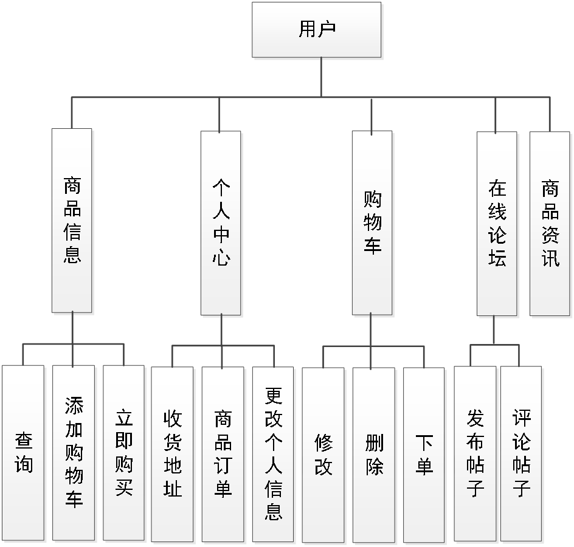

# springboot121-网络海鲜市场系统的设计与实现

>  博主介绍：
>  Hey，我是程序员Chaers，一个专注于计算机领域的程序员
>  十年大厂程序员全栈开发‍ 日常分享项目经验 解决技术难题与技术推荐 承接各类网站设计，小程序开发，毕设等。
>  【计算机专业课程设计，毕业设计项目，Java，微信小程序，安卓APP都可以做，不仅仅是计算机专业，其它专业都可以】

## 3000套系统可挑选，获取链接：https://chaerspol.github.io/

<b>QQ【获取完整源码】：674456564</b>

<b>QQ群【获取完整源码】：1058861570</b>

### 系统架构

> 前端：html | js | css | jquery | vue
>
> 后端：springboot | mybatis
> 
> 环境：jdk1.8+ | mysql | maven

# 一、内容包括
包括有  项目源码+项目论文+数据库源码+答辩ppt+远程调试成功

# 二、运行环境

> jdk版本：1.8 及以上； ide工具：IDEA； 数据库: mysql5.7及以上；编程语言: Java

# 三、需求分析

**3.1 可行性研究**

网络海鲜市场系统开发实现分析需要从不同的角度来进行分析可行性，比如从时间角度，经济角度，甚至操作角度。从不同的角度分析可行性会让网络海鲜市场系统开发具体化，进而达到辩证开发的正确性。

**3.1.1 经济可行性**

从经济方面分析是第一要素，没有经济的支持，任何项目都如水中捞月，无法实现。实现网络海鲜市场系统，开发过程不需要额外的经济条件，用本人现有的计算机就可以实现，这方面不需要额外的支出。

**3.1.2 时间可行性**

网络海鲜市场系统设计主要作为毕业设计，在题目确定之后，答辩之前使用的项目，对不同的开发进度上面都有时间的要求，总不至于答辩完成后才能实现功能，这个肯定不行，所以从时间上来分析项目的工作量，发现是可行的，符合正常开发时间。

**3.1.3 操作可行性**

操作必须符合正常人的思维模式，市面上有很多符合要求的程序正在使用中，可以借鉴其他程序的操作流程，变成符合本设计的操作流程，在操作上面进行无缝衔接，让使用者操作过程中不会感到迷茫。
从上面的角度来分析，后续工作可以继续进展。

**3.2 系统性能分析**

性能分析是软件开发过程中必不可少的一个环节，主要是为了降低软件在使用的过程中的容错率。通常来讲，分析软件系统的性能一般从以下几个方面进行分析。

**3.2.1 系统的安全性**

系统开发出来就是让正常使用的，那么在如今的互联网时代，首先考虑的就是安全性的问题。如果系统的安全性不够，那么使用价值就会降低。如果出现使用过程中丢失数据，那么用户就不再信赖，所以系统的安全性是第一要位，只有安全性存在了，才能考虑使用的问题，总不至于今天用户注册，明天用户账号泄露，这些都是不友好的。所以账号一般在数据库里存储会通过MD5进行加密，这样关键数据加密可以保证系统的安全性。

**3.2.2 系统的易用性**

安全性分析处理完毕，才考虑易用性。一个软件设计得符合操作规范，符合正常人类的理解逻辑，那么在使用上面就会很舒服，如果违背了这条原则，安全性再高的软件也是设计失败的，毕竟软件开发出来就是让人使用的，这一点尤为重要。

**3.2.3 系统的健壮性**

系统设计易用不代表没有规则，那么系统设计使用方面必须健壮，必须符合软件处理逻辑。比如设计一个价格类的输入框，用户需要输入价格，那么可以设定输入框最多两位小数的纯数字输入，如果用户不小心输入了其他字符，那么就会友好的提示让用户修改正确，只有输入符合规范的数据，才能进行提交，并且存储到数据库里。系统的健壮性就是这样，越是规范，越是健壮，有助于用户理解，还有助于程序使用。

**3.3 系统流程分析**

系统设计不是胡乱的设计，必须符合软件设计思想，具体的流程参考下图。系统设计的前期就是做各种分析，功能的设计，数据库的设计等，等一切都设计好了，逻辑上没有问题，符合设计流程和设计规范，才可以继续编码环节，编码只是实现设计的一个环节而已。

# 四、功能模块

对管理员具体功能的设计结果将以图所示的管理员功能结构图来进行体现。管理员对于网络海鲜市场系统操作的功能包括对商品资讯，用户信息，商品信息等进行增删改查，同时可以回复用户对商品的评价，以及管理商品订单和论坛帖子。

对用户具体功能的设计结果将以图所示的用户功能结构图来进行体现。用户对于网络海鲜市场系统操作的功能包括在前台购买商品，管理收货地址，管理购买的商品信息，查看商品资讯，管理购物车等。

# 五、效果图展示【部分效果图】

图5.1 论坛管理界面【在此界面，管理员不仅需要跟踪论坛帖子，比如查看论坛帖子的回复，删除论坛帖子的回复信息等，修改论坛帖子的内容，删除需要删除的论坛帖子信息等】

图5.2 商品管理界面【在此界面，对商品的类型，商品原价，商品库存，商品名称等信息都需要管理员负责添加和修改，同时还需要对商品的库存进行管理，比如增加商品的库存，或者是对商品库存进行减少以及对销量不好的商品进行下架，对新的商品进行上架等操作】

图5.3 商品评价管理界面【在此界面，商品的评价内容，以及评价用户和评价的商品等信息都能让管理员查看，同时管理员也能对评价商品的用户进行回复】

图5.4 商品订单管理界面【在此界面，管理员主要处理已经销售的商品信息，即商品订单信息，管理员需要对用户刚刚支付的商品订单进行及时发货，以及对各个商品订单的更多的详细信息进行认真查看】

图5.5 商品资讯管理界面【在此界面，商品资讯的内容以及图片等信息都是管理员负责登记的信息，也包括后期对商品资讯信息的针对性修改和删除等都是管理员负责的内容】

图5.6 商品信息界面【在此界面，用户可以查看商品信息界面展示的商品相关视频，以及通过对商品的相关介绍信息来了解商品，用户如果有购买的需求，可以通过立即购买功能立即下单】

 <b>完整文章</b>
    
 
 

## 3000套系统可挑选，获取链接：https://chaerspol.github.io/

<b>QQ【获取完整源码】：674456564</b>

<b>QQ群【获取完整源码】：1058861570</b>

